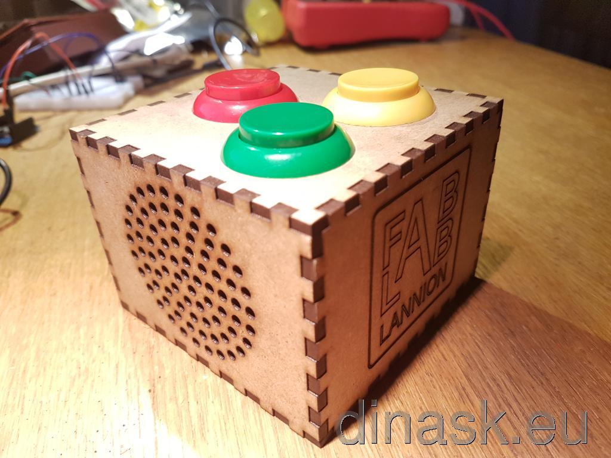
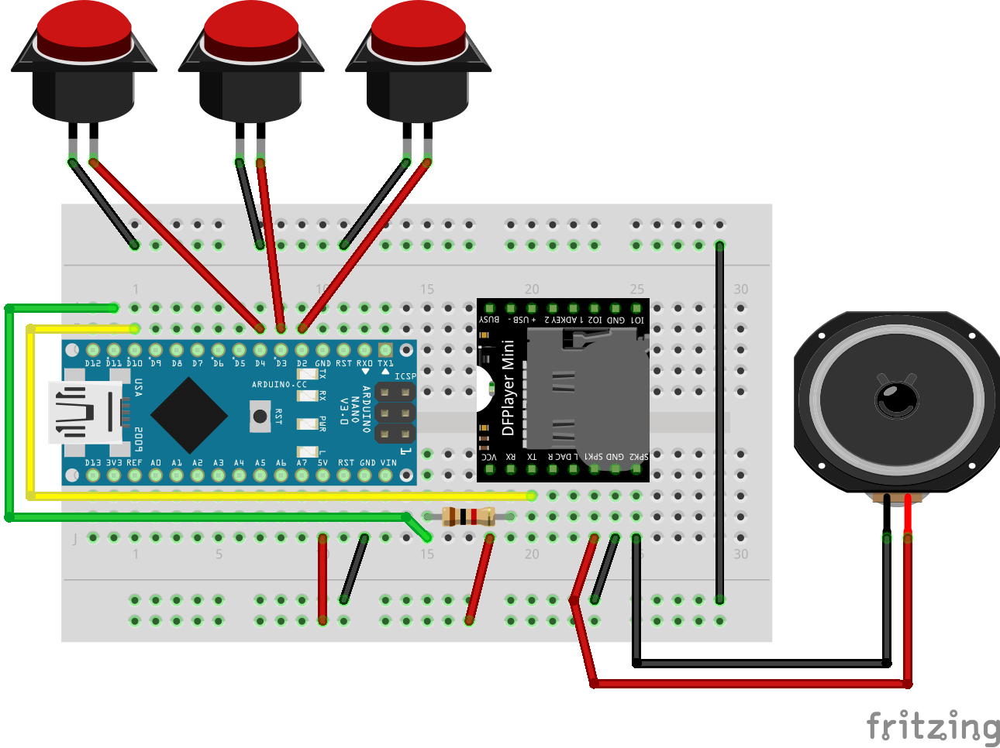

 
# Sound Buttons

A box with 3 buttons. Each button just plays a mp3.
Buttons can be combined for up to 7 sounds.

## Electronic

1st version very simple, with breadboard, arduino and DFPlayer mini

## Hardware
* Case to be lasercutted in `Case/`
* 3 arcade buttons

## Program
See `Firmware/` directory.

Used libs :
* [DFMinimp3](https://github.com/Makuna/DFMiniMp3) 1.0.1 by Makuna
* [Arduino-SerialCommands](https://github.com/ppedro74/Arduino-SerialCommands) 1.1.0 by ppedro74

On the SD card, create `mp3/` directory with 3 mp3 files. Each file has to be named 000X_whatever.mp3 with X in 1-7 and whatever beeing whatever you want :)

Playing order :
* 0001 : first button
* 0002 : second button
* 0003 : first + second buttons
* 0004 : third button
* 0005 : first + third buttons
* 0006 : second + third buttons
* 0007 : first + second + third buttons
